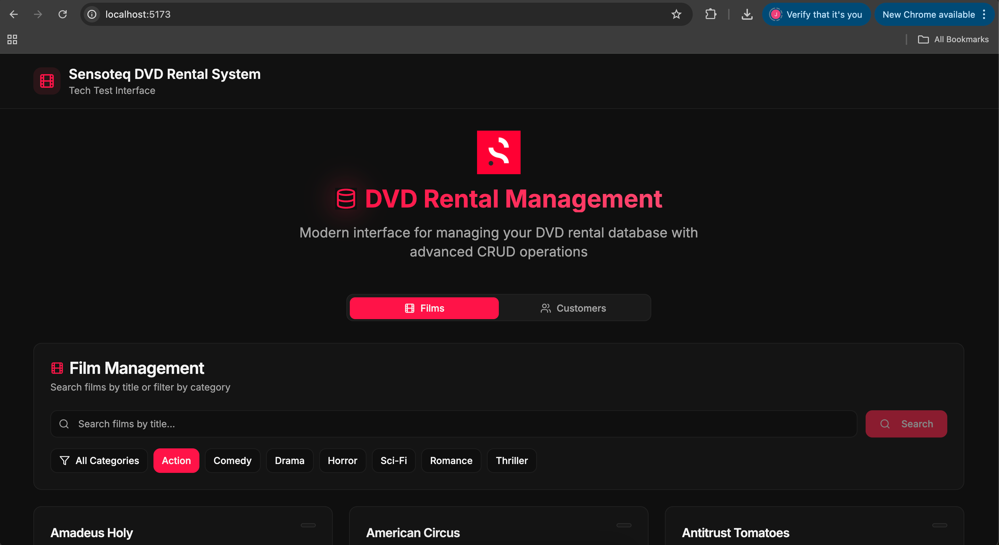

# Sensoteq Technical Test - Full Stack Engineer




### To Build & Run:

```
docker compose up -d --build 
```

### Frontend
The Frontend is running on http://localhost:5173/


### Backend
The backend is running on http://localhost:3000/


### To Test

Run Service tests
```
cd backend
pnpm run test:service
```

Run Unit tests

```
cd backend
pnpm run test:unit
```


## Tech Stack
###  Backend
 - Typescript
 - Express
 - Keysely

###  Frontend
  - React
  - Radix UI

- Docker


# API Overview

```
GET /films?category_name=Action
```

curl -s "http://localhost:3000/films?category_name=Action" | jq


```
GET /films/search?title=to&length=60 
```

curl -s "http://localhost:3000/films/search?title=to&length=60" | jq


```
POST /customer 

BODY { 
    "store_id": 1,
    "first_name": "Ada",
    "last_name": "Lovelace",
    "email": "ada.lovelace@example.com",
    "phone": "0123456789",
    "address": "123 Algorithm Ave",
    "address2": "Apt 42",
    "district": "Antrim",
    "city_id": 1,
    "postal_code": "BT1 1AA"
}
```

curl -s -X POST "http://localhost:3000/customers" \
  -H "Content-Type: application/json" \
  -d '{
    "store_id": 1,
    "first_name": "Ada",
    "last_name": "Lovelace",
    "email": "ada.lovelace@example.com",
    "phone": "0123456789",
    "address": "123 Algorithm Ave",
    "address2": "Apt 42",
    "district": "Antrim",
    "city_id": 1,
    "postal_code": "BT1 1AA"
  }' | jq


```
DELETE /customer/:customerid 
```

curl -i -X DELETE "http://localhost:3000/customers/40"
